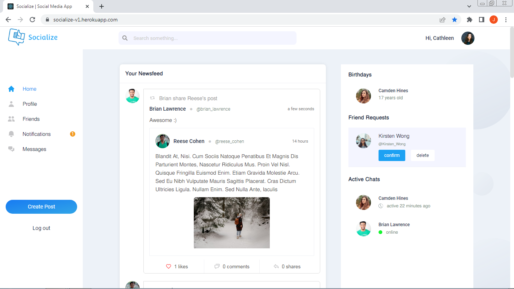
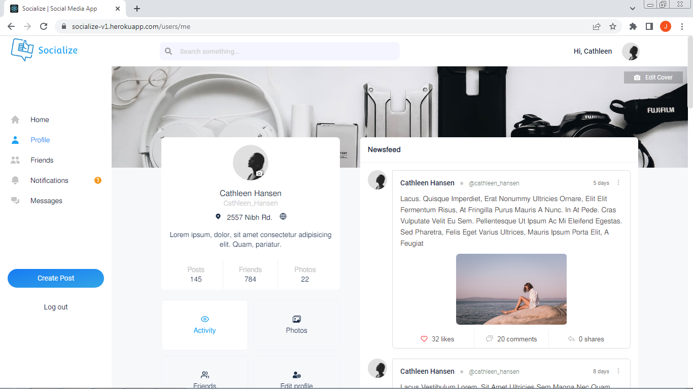
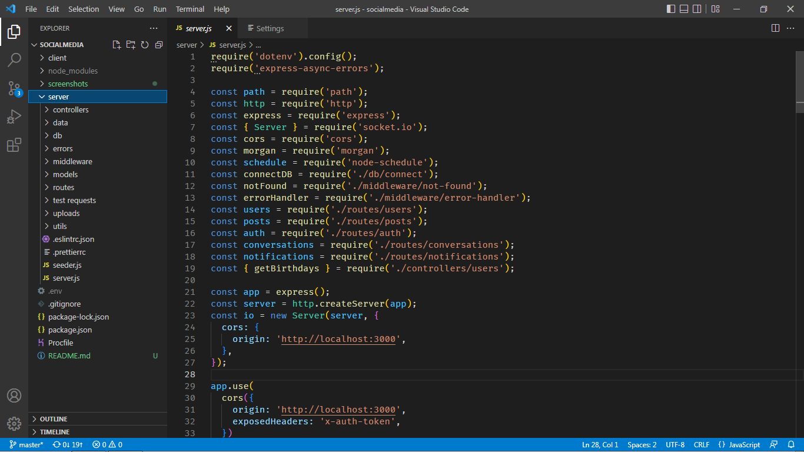

## Socialize  ( socialmedia app)

A socialmedia application built from scratch using MongoDB, Express, React, NodeJs (MERN stack).

## Technology used

* NodeJs with Express Framework
* MongoDB with mongoose ODM
* JWT
* Socket.IO
* React JS 
* Redux (used redux toolkit)
* React Router Dom v6
* Sass
  
  
## App Features

#### Backend

* Authentication and Authorization with JWT
* Properly tested using jest (unit and integration test)
* Follow REST API convention
* MVC structure
* Code using Airbnb style guide (frontend and backend)
* Error handling
* Seeding

### Frontend

* Login/Signup
* Post creation, Sharing and liking post
* Comments and replies
* Realtime messaging
* Realtime Notification
* Friends 

This project is currently in development. Users can filter tweets by username and keyword and see visual data representation. Functionality to sort by additional parameters is in progress.

## Project Screen Shot(s)

#### Frontend

#### Backend   

## Installation and Setup Instructions

Clone down this repository. You will need `node` and `npm` installed globally on your machine.  

Installation:

`npm install`  

To Start Server:

`npm run server`  

To Start Client:

`npm run client`  

To Start both Frontend and Server:

`npm run dev`  

## Reflection

  It took me several months to finished since i only do it on my free time and weekends since i am studying in college. ALso i made it from scratch from frontend to backend which causes a lot of time specially from styling. I made this project to further strengthen my knowledge on MERN stack. 

  I choose socialmedia becase it has a lot of features to implement meaning i can utilize a lot of node and react functionalities to have good backend and apealing frontend
  
  Developing the project was fun and challenging i came up with problems that took hours to solve but i managed to fix those errors.
  
  I needed to re-build the database model for better query optimization. i should think more of the model from the very start but really its impossible to planned all functionalities at once.
  
  I choose Express as Node js framework because it is the most popular and it is easy to use. it doesn't mandate me what to use packages and limit me on how i organize my files and codes. 
  
  I choose react js because it is the most popular and it is perfect in this big project. alongside with react i use redux as state management tool over context API because it is easy to lost track of state if i uuse context API specially in this size of project.  

  I learned a lot in this project because i touch some concepts that i didnt work on before like websockets. Also some packages have major changes and breaks the app. Overall it was fun building this project 